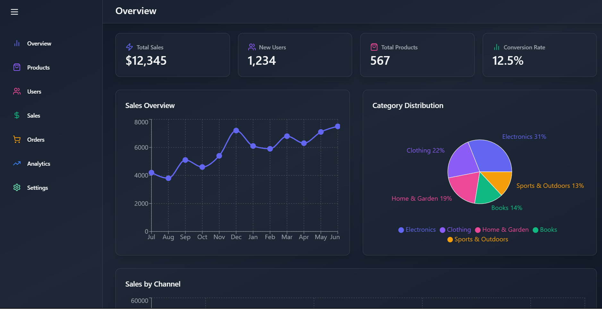
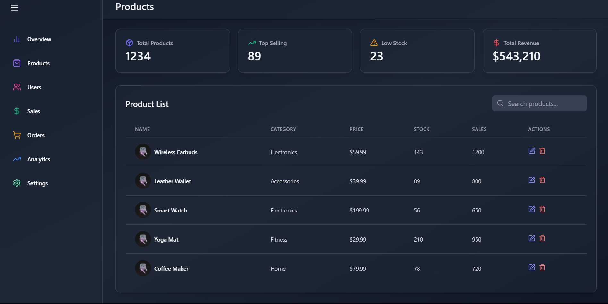
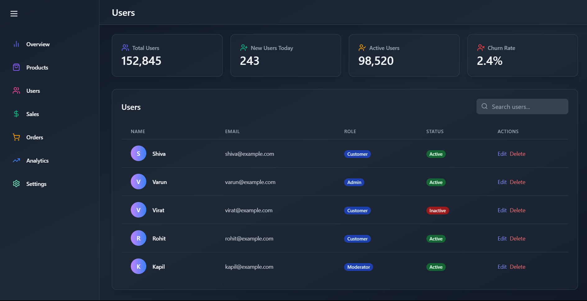
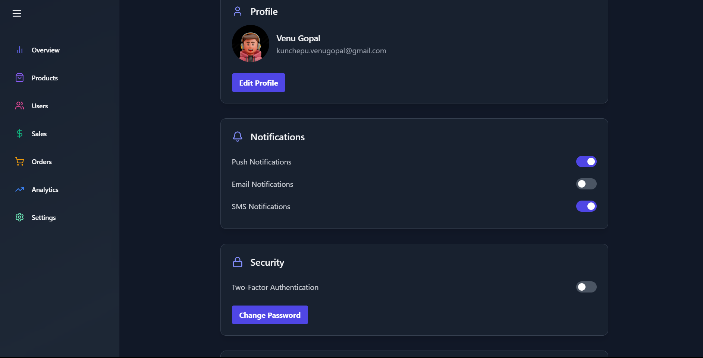
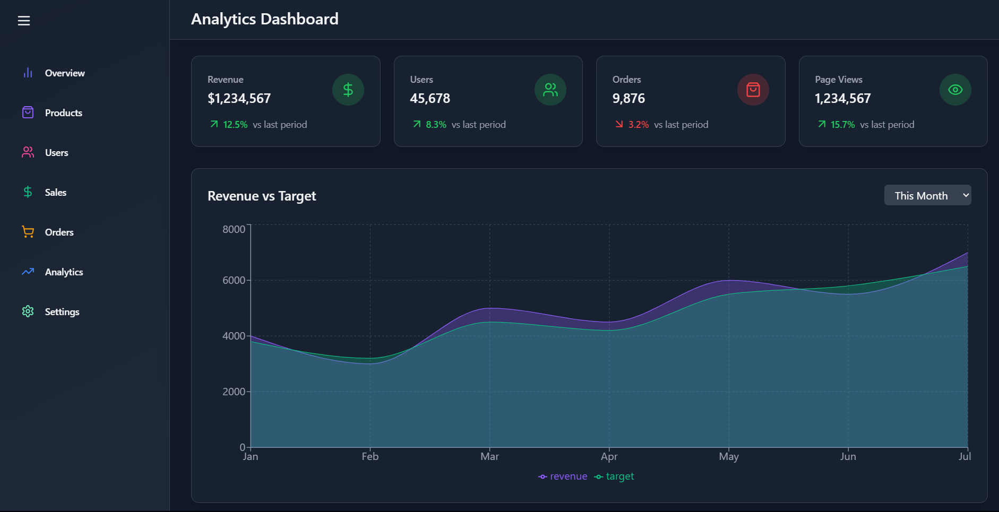
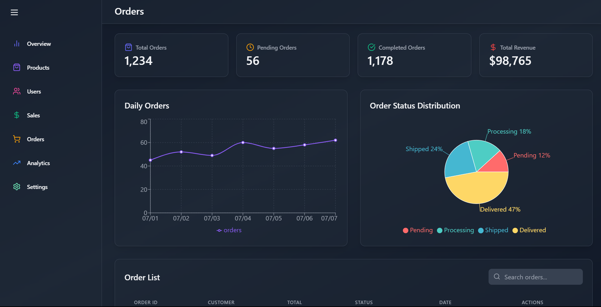

# React Admin Dashboard

<p align="center">
  
  
  
  
  
  
</p>

## Live Link
   https://react-admin-dashboard-gamma-two.vercel.app/


## Installation

1. Install dependencies:
   ```bash
   npm install
   ```
2. Start the development server:
   ```bash
   npm run dev
   ```